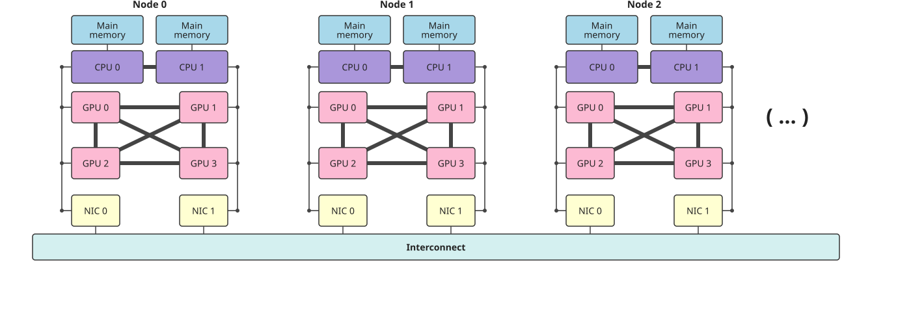
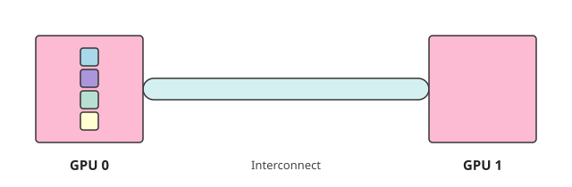
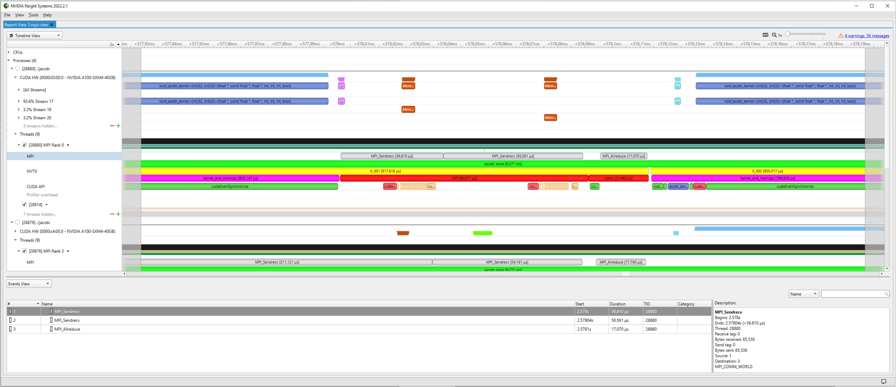
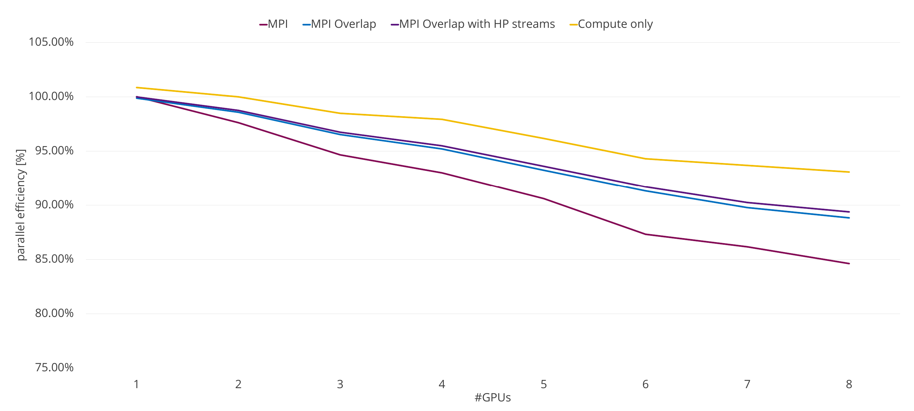

# Introduction

## What we will cover

* [Very brief] recap of the Message Passing Interface (MPI)
* How to distribute work to GPUs using MPI
* GPU-aware MPI
* Optimization techniques to improve performance of multi-GPU applications:
  * Binding MPI processes to specific CPU cores, GPUs and NICs
  * Packing kernels
  * Overlapping computation and communication

## Training material

The material for this course is available in [this
repository](https://github.com/mirenradia/dirac-gppt-multi-gpu) on GitHub. You
will need to clone it to your CSD3 training account in order to complete the
exercises:

```{.bash code-line-numbers="false"}
git clone https://github.com/mirenradia/dirac-gppt-multi-gpu.git
```

These slides can be found at
[tinyurl.com/dirac-multi-gpu](https://tinyurl.com/dirac-multi-gpu). Press the
`M` key to view the menu and navigate to specific slides.

# MPI Recap

## What is MPI? {.smaller}

* The Message Passing Interface (MPI) is a *standard* for distributed memory
  parallel programming.
* It defines an application programming interface (API) to exchange messages
  between processes that don't [necessarily] share memory for C and Fortran:
  * Point to point communication e.g. `MPI_Send`, `MPI_Recv`
  * Collective communication e.g. `MPI_Bcast`, `MPI_Reduce`, `MPI_Alltoall`
* Third-party support for other languages e.g. Python (mpi4py) and Julia
  (MPI.jl)
* Version 5.0 of the standard was released on 5 June 2025 and defined ABI
  compatibility between MPI implementations allowing users to switch between
  implementations without recompiling their code[^mpi-5].
* Various different implementations e.g.:
  * Open MPI based: Open MPI, Nvidia HPC-X
  * MPICH based: MPICH, Intel MPI, Cray MPI, MVAPICH

[^mpi-5]: Currently only MPICH v5.0+ has support for this but older MPICH-based
implementations have had ABI compatibility between each other for a while.


## Example MPI program (C++)

```cpp
#include <mpi.h>
#include <iostream>

int main(int argc, char* argv[])
{
    MPI_Init(&argc, &argv);

    int world_size;
    MPI_Comm_size(MPI_COMM_WORLD, &world_size);

    int world_rank;
    MPI_Comm_rank(MPI_COMM_WORLD, &world_rank);

    std::cout << "Hello from rank " << world_rank << " of "
              << world_size << std::endl;

    MPI_Finalize();
}
```

## Example MPI program (Fortran)

```fortran
program hello_mpi
  use mpi_f08
  implicit none

  integer :: world_size, world_rank

  call MPI_Init()
  call MPI_Comm_size(MPI_COMM_WORLD, world_size)
  call MPI_Comm_rank(MPI_COMM_WORLD, world_rank)

  print *, "Hello from rank ", world_rank, " of ", world_size

  call MPI_Finalize()
end program hello_mpi
```

## MPI references

* [MPI Forum Documentation](https://www.mpi-forum.org/docs/)
* [Open MPI Documentation](https://docs.open-mpi.org)
* [MPICH Man Pages](https://www.mpich.org/static/docs/latest/)
* [Rookie HPC MPI Docs](https://rookiehpc.org/mpi/index.html)[^rookie-hpc]

[^rookie-hpc]: Some newer/more advanced MPI routines are missing here.

# Distributing work to GPUs

<!-- The inline SVG images are quite long hence included separately -->


## Distributing GPUs to local MPI ranks (CUDA/HIP)

```cpp
int world_rank;
MPI_Comm_rank(MPI_COMM_WORLD, &world_rank);
MPI_Comm local_comm;
MPI_Comm_split_type(MPI_COMM_WORLD, MPI_COMM_TYPE_SHARED, world_rank,
                    MPI_INFO_NULL, &local_comm);

int local_rank = -1;
MPI_Comm_rank(local_comm, &local_rank);
MPI_Comm_free(&local_comm);

int num_devs = 0;
cudaGetDeviceCount(&num_devs);
cudaSetDevice(local_rank % num_devs);
```

## Distributing GPUs to local MPI ranks (OpenMP)

```fortran
use mpi_f08
use omp_lib

integer :: world_rank, local_rank, num_devs
type(MPI_Comm) :: local_comm

call MPI_Comm_rank(MPI_COMM_WORLD, world_rank)
call MPI_Comm_split_type(MPI_COMM_WORLD, MPI_COMM_TYPE_SHARED, world_rank, &
                         MPI_INFO_NULL, local_comm)

call MPI_Comm_rank(local_comm, local_rank)
call MPI_Comm_free(local_comm)

num_devs = omp_get_num_devices()
call omp_set_default_device(mod(local_rank, num_devs))
```

## Why one MPI process per GPU? {.smaller}

* Why not more GPUs per MPI process?
  * Each GPU has its own memory space and it makes sense to use MPI to
    communicate data between GPUs both intra-node and inter-node.
  * You would need to handle memory transfers between GPUs in the same MPI
    process manually (e.g. using CUDA/HIP or OpenMP) so would have two different
    methods of communicating data between GPUs.
* Why not more MPI processes per GPU?
  * This is possible if the work of a single MPI process is too small to fully
    utilize a whole GPU.
  * On Nvidia GPUs, to use multiple MPI processes per GPU efficiently, you need
    to use the Multi-Process Service (MPS) to reduce context switching
    overheads (check docs/HPC user support if system has MPS available).
  * On AMD GPUs, this is not necessary.
  * Best to start with one MPI process per GPU and only try more if necessary.
* Some GPUs (e.g. AMD MI250X and Intel Data Center GPU Max 1550/PVC) are
  essentially two GPUs fused together so it is often best here to use two MPI
  processes per GPU.

# GPU-aware MPI

## What is GPU-aware MPI? {.smaller}

* GPU-aware MPI implementations allow you to pass GPU pointers directly to MPI
  routines without having to copy data to host memory first.
* Often referred to as "CUDA-aware MPI" for Nvidia GPUs.
* Not part of the standard so implementation-dependent.
  * If available it is usually optional so you need to check if implementation
    has been built with it.
  * Should be available on all GPU HPC systems.
  * Best practice: keep copying data to host memory as a fallback.
* Open MPI is the most common implementation that can be built with GPU support
  for Nvidia or AMD GPUs (usually provided by the lower level UCX library).
  We will focus on it from now on.
* Consult system documentation for details: you may need to set environment
  variables to enable support:
  * `MPICH_GPU_SUPPORT_ENABLED=1` for MPICH and Cray MPI.
  * `I_MPI_OFFLOAD=1` for Intel MPI.
  * `MV2_USE_CUDA=1` or `MV2_USE_ROCM=1` for MVAPICH2.

## No GPU-aware MPI (CUDA/HIP) {auto-animate="true"}

Without GPU-aware MPI, data transfers between host and GPU memory must be
handled manually (or rely on managed/unified memory):

```{.cpp code-line-numbers="|5|12|"}
size_t size = 1024;
double* d_ptr;
double* h_ptr;
cudaMalloc(&d_ptr, size * sizeof(double));
cudaMallocHost(&h_ptr, size * sizeof(double));

<some CUDA kernel that fills d_ptr with data>

int dest_rank = 1;
int tag = 0

cudaMemcpy(h_ptr, d_ptr, size * sizeof(double), cudaMemcpyDeviceToHost);
MPI_Send(h_ptr, size, MPI_DOUBLE, dest_rank, tag, MPI_COMM_WORLD);
```

## With GPU-aware MPI (CUDA/HIP) {auto-animate="true"}

With CUDA/HIP, it's as simple as just passing a pointer to GPU memory to an MPI
routine:

```{.cpp code-line-numbers="|10"}
size_t size = 1024;
double* d_ptr;
cudaMalloc(&d_ptr, size * sizeof(double));

<some CUDA kernel that fills d_ptr with data>

int dest_rank = 1;
int tag = 0

MPI_Send(d_ptr, size, MPI_DOUBLE, dest_rank, tag, MPI_COMM_WORLD);
```

## Passing GPU pointers to MPI (OpenMP)

With OpenMP, it's necessary to add the following directive to ensure the GPU
pointer is passed:

```{.fortran code-line-numbers="|10,12"}
integer, parameter :: size = 1024
double precision, allocatable :: d_array(:)
integer :: dest_rank = 1, tag = 0

allocate(d_array(size))
!$omp target enter data map(alloc: d_array)

<some OpenMP kernel that fills d_array with data>

!$omp target data use_device_addr(d_array)
call MPI_Send(d_array, size, MPI_DOUBLE, dest_rank, tag, MPI_COMM_WORLD)
!$omp end target data
```

## How to build GPU-aware MPI programs {.smaller}

All examples below are for Open MPI but can use other MPI implementations by
suitably replacing `OMPI_*` environment variables.

<!-- Mention both CUDA/HIP and OpenMP  -->
* CUDA C++ (with `g++` as host compiler):
  ```{.bash code-line-numbers="false"}
  OMPI_CXX=nvcc mpicxx -x cu --ccbin=g++ --forward-unknown-to-host-compiler <nvcc and g++ flags> \
      -o my_mpi_cuda_program my_mpi_cuda_progam.cpp
  ```

* HIP C++: Set `OMPI_CXX=hipcc` or `OMPI_CXX=amdclang++` and then use `mpicxx`
  as the compiler e.g.:
  ```{.bash code-line-numbers="false"}
  OMPI_CXX=amdclang++ mpicxx -x hip --offload-arch=<gpu arch> -o my_mpi_hip_program my_mpi_hip_program.cpp
  ```

* Nvidia Fortran compiler with OpenMP:
  ```{.bash code-line-numbers="false"}
  OMPI_FC=nvfortran mpifort -mp=gpu -gpu=<gpu arch> -o my_mpi_openmp_program my_mpi_openmp_program.f90
  ```

* AMD Flang compiler with OpenMP:
  ```{.bash code-line-numbers="false"}
  OMPI_FC=amdflang mpifort -fopenmp  -fopenmp-targets=<gpu arch> -o my_mpi_openmp_program my_mpi_openmp_program.f90
  ```

## What's happening under the hood? {.smaller}

* Simple and naive GPU-aware implementation (or fallback):
  * MPI implementation detects GPU pointer and copies data to host memory before
    sending it over the network.
  * On the receiving side, data is copied from host memory to GPU memory.
* Most GPU-aware MPI implementations use a more efficient approach that allows
  data to be sent directly between GPU memory without going through the host:
  * For GPUs on the same node, this can be done using peer-to-peer (P2P) memory
    access.
  * For GPUs on different nodes, this can done using remote direct memory access
    (RDMA) over the network.
* Nvidia: GPUDirect P2P and GPUDirect RDMA (GDR)
* AMD: RDMA and P2P are part of the AMD kernel driver.

## No GPU-aware MPI

Without GPU-aware MPI, data must be copied to host memory. There is also some
additional overhead in copying data to/from pinned memory.



## GPU-aware MPI without P2P/RDMA

Even without P2P/RDMA, GPU-aware MPI is still more efficient than non-GPU-aware
MPI as the MPI library can use lower-level optimizations to copy data between
GPU and host memory.



## GPU-aware MPI with P2P/RDMA

GPU-aware MPI with P2P/RDMA is the most efficient as it allows data to be sent
directly between GPU memory without going through host memory.



## Example: Jacobi solver {.smaller}

* This example solves the 2D Laplace equation in a rectangle:
  $$
  \nabla^2 u = 0\text{ on }\Omega = (0, L_x) \times (0, L_y)
  $$
* We use Dirichlet boundary conditions on the left/right boundaries and periodic
  boundary conditions on the top/bottom boundaries:
  $$
  u(0, y) = u_0, \quad u(L_x, y) = u_1, \quad u(x, 0) = u(x, L_y)
  $$
* We discretize the domain using a uniform grid and use the Jacobi method to
  iteratively solve for $u$ at each grid point. At iteration $k$, the value of
  $u$ at grid point $(x_i,y_j)$ is computed as follows:
  $$
  u_{i,j}^{(k+1)} = \frac{1}{4} \left( u_{i-1,j}^{(k)} + u_{i+1,j}^{(k)} +
                    u_{i,j-1}^{(k)} + u_{i,j+1}^{(k)} \right)
  $$

## Example Jacobi solver (cont.)

In pseudocode, it's roughly:

```
while not converged:
    for each grid point (i,j):
        u_new[i,j] = 0.25 * (u[i-1,j] + u[i+1,j] + u[i,j-1] + u[i,j+1])

    # Apply periodic boundary conditions
    for each grid point i
        u_new[i,0] = u_new[i, ny-1]
        u_new[i,ny] = u_new[i, 1]

    swap(u, u_new)

    next iteration
```

<!-- The inline SVG images are quite long hence included separately -->


## Exercise 01: Jacobi solver {.smaller}

Use GPU-aware MPI to parallelize the Jacobi solvers across multiple GPUs. You
will need to do the following:

1. Get the available GPU devices and use it and the local rank to set the active
   GPU for each process.
1. Compute the top and bottom neighbours (recall: periodic BCs on top/bottom).
1. Use `MPI_Sendrecv` with GPU-resident pointers/arrays to exchange data between
   the neighbors.

You can either choose CUDA+C++ or OpenMP+Fortran. Further details are provided
in the respective README files.

There is an "advanced" extension task if you finish early.

## Exercise 01: Solution {auto-animate="true"}

### Setting the active GPU

```{.cpp startFrom="234"}
    int num_devices = 0;
    // TODO: Get the available GPU devices into `num_devices` and use it and the current rank to set the active GPU.
```

## Exercise 01: Solution {auto-animate="true"}

### Setting the active GPU

```{.cpp startFrom="234"}
    int num_devices = 0;
    // TODO: Get the available GPU devices into `num_devices` and use it and the current rank to set the active GPU.
    CUDA_RT_CALL(cudaGetDeviceCount(&num_devices));
    CUDA_RT_CALL(cudaSetDevice(local_rank%num_devices));
```

## Exercise 01: Solution {auto-animate="true"}

### Computing the top and bottom neighbors

```{.cpp startFrom="306"}
        //TODO: Compute top and bottom neighbor, use reflecting/periodic boundaries. This means rank 0 and rank (size-1)
        // exchange data
        const int top = 0;
        const int bottom = 0;
```

## Exercise 01: Solution {auto-animate="true"}

### Computing the top and bottom neighbors

```{.cpp startFrom="308"}
        //TODO: Compute top and bottom neighbor, use reflecting/periodic boundaries. This means rank 0 and rank (size-1)
        // exchange data
        const int top = rank > 0 ? rank - 1 : (size - 1);
        const int bottom = (rank + 1) % size;
```

## Exercise 01: Solution {auto-animate="true"}

### Using `MPI_Sendrecv` to exchange data between neighbors

```{.cpp startFrom="311"}
        // TODO: Use MPI_Sendrecv to exchange the data with the top and bottom neighbors
        // Use CUDA-aware MPI here, i.e. receive the data directly in a_new on the GPU and send it from there
        // without manually copying the data.

        // The first newly calculated row ('iy_start') is sent to the top neigbor and the bottom boundary row
        // (`iy_end`) is received from the bottom process.
        // The last calculated row (`iy_end-1`) is send to the bottom process and the top boundary (`0`) is received from the top
        // Don't forget to synchronize the computation on the GPU before starting the data transfer
```

## Exercise 01: Solution {auto-animate="true"}

### Using `MPI_Sendrecv` to exchange data between neighbors

```{.cpp startFrom="313"}
        // TODO: Use MPI_Sendrecv to exchange the data with the top and bottom neighbors
        // Use CUDA-aware MPI here, i.e. receive the data directly in a_new on the GPU and send it from there
        // without manually copying the data.

        // The first newly calculated row ('iy_start') is sent to the top neigbor and the bottom boundary row
        // (`iy_end`) is received from the bottom process.
        // The last calculated row (`iy_end-1`) is send to the bottom process and the top boundary (`0`) is received from the top
        // Don't forget to synchronize the computation on the GPU before starting the data transfer
        CUDA_RT_CALL(cudaEventSynchronize(compute_done));
        PUSH_RANGE("MPI", 5)
        MPI_CALL(MPI_Sendrecv(a_new + iy_start * nx, nx, MPI_REAL_TYPE, top, 0,
                              a_new + (iy_end * nx), nx, MPI_REAL_TYPE, bottom, 0, MPI_COMM_WORLD,
                              MPI_STATUS_IGNORE));
        MPI_CALL(MPI_Sendrecv(a_new + (iy_end - 1) * nx, nx, MPI_REAL_TYPE, bottom, 0, a_new, nx,
                              MPI_REAL_TYPE, top, 0, MPI_COMM_WORLD, MPI_STATUS_IGNORE));
        POP_RANGE
```
# Optimization techniques

## Why optimization is *more* important on GPUs

* Once you have offloaded heavy computations to the GPU, the remaining
  bottlenecks are often either:
  * Memory transfers between host and device.
  * Communication between GPUs.
* Keeping data GPU-resident as much as possible including by using GPU-aware MPI
  can help reduce memory transfer bottlenecks
* There's not usually a single "best" way to optimize communication between GPUs
  but there are some common techniques we will cover that may improve
  performance.
* Many are also relevant to CPU-only MPI applications but the relative
  performance gains may be more significant on GPUs.

## NUMA, affinity and GPU distribution {.smaller transition="slide-in fade-out"}

{.nostretch height="240px" fig-align="center"}

* Note that in the node diagram, GPUs 0 and 2 are "closest" to CPU 0 and GPUs 1
  and 3 are "closest" to CPU 1.
* Similarly, GPUs 0 and 1 are "closest" to NIC 0 and GPUs 2 and 3 are "closest"
  to NIC 1.
* This diagram is somewhat arbitrary and the actual topology differs between
  systems.
* Within just the CPU, for a given CPU cores, some memory domains are "closer"
  than others. This is known as Non-Uniform Memory Access (NUMA).
* The differences in distance can mean, for a specific GPU, it may be faster to
  transfer/read data to/from specific CPU cores and NICs compared to others.

## NUMA, affinity and GPU distribution {.smaller transition="fade-in slide-out"}

{.nostretch height="240px" fig-align="center"}

* To achieve the best performance, it is often necessary to bind specific CPU
  cores, a specific GPU and a specific NIC to each MPI process.
* It is technically possible to figure out the topology yourself using tools
  such as `hwloc-ls` and `nvidia-smi topo` and then write a binding script but
  it is usually best and easiest to check the system documentation to see if one
  has been provided.
* Typically, these scripts are used in your MPI launch line:
  ```{.bash code-line-numbers=false}
  mpiexec <MPI options> ./binding_script.sh <application> <options>
  ```

## Example GPU binding script (CSD3 Ampere nodes)

```{.bash code-line-numbers="|2|4-5|7-9|11-12|14-18"}
#!/bin/bash
GPUS=(0 1 2 3)

# associate GPUs 0,1 with MLX0, GPUs 2,3 with MLX1
NICS=(mlx5_0:1 mlx5_0:1 mlx5_1:1 mlx5_1:1)

# On the Ampere nodes we have 2x64 core CPUs, each organised into 4 NUMA domains
# We will use only a subset of the available NUMA domains, i.e. 1 NUMA domain per GPU
CPUS=(48-63 16-31 112-127 80-95)

# This is the list of memory domains we should use for each GPU
MEMS=(3 1 7 5)

lrank=$OMPI_COMM_WORLD_LOCAL_RANK

export CUDA_VISIBLE_DEVICES=${GPUS[${lrank}]}
export UCX_NET_DEVICES=${NICS[${lrank}]}
numactl --physcpubind="${CPUS[${lrank}]}" --membind="${MEMS[${lrank}]}" "$@"
```

## Packing kernels {.smaller}

:::: {.columns}

::: {.column width="50%"}
* Since there is a greater overhead in launching GPU kernels, sending lots of
  small messages between GPUs is often more inefficient than
  doing the same in a CPU-only MPI application.
* It is usually more efficient to "pack" multiple small messages into a single
  larger buffer and send that instead.
* If you use MPI derived datatypes with non-contiguous data, the MPI
  implementation will usually not pack the data for you so communication will be
  inefficient → Replace with packing kernels.
* Since packing kernels will typically be quite small, it is best to launch them
  asynchronously (`nowait` clause for OpenMP and `taskwait` to synchronize).
:::

::: {.column width="50%"}
{width="100%" text-align="center"}

{width="100%" text-align="center"}
:::

::::

## Packing kernels {.smaller}

:::: {.columns}

::: {.column width="50%"}
* For each pair of communicating processes, you can achieve this as follows:
  1. Allocate a single contiguous GPU-resident buffer to send data and another
     to receive data.
  1. Launch a kernel to pack the data to be sent into the send buffer.
  1. Send the packed buffer to the other GPU using GPU-aware MPI.
  1. Launch a kernel to unpack the received buffer at the other end as required.
:::

::: {.column width="50%"}
{width="100%" text-align="center"}

{width="100%" text-align="center"}
:::

::::

## Other MPI optimization techniques {.smaller}

* You probably don't need `MPI_Barrier`s for correctness. Unnecessary
  synchronization can be expensive.
* Where you can, use non-blocking communication routines.
  * These are usually prefixed with `MPI_I` e.g. `MPI_Isend`, `MPI_Irecv`.
  * These allow you to overlap communication with computation.
  * Remember to synchronize appropriately e.g. with `MPI_Wait` before trying to
    access received data.
* Use MPI collective communication routines (e.g. `MPI_Allreduce`, `MPI_Bcast`,
  `MPI_Alltoall`) where possible (non-blocking versions available since MPI
  3.0).
  * Many MPI implementations have optimized collective communication routines
    that can be significantly more efficient than implementing collectives
    naively with point-to-point calls.
  * Figuring out when you might be accidentally implementing collectives naively
    can be non-trivial.
  * Neighbourhood collectives may be more efficient for exchanging halo regions
    in a decomposed domain.

## Exercise 02: Packing kernels and non-blocking communication {.smaller}

Replace multiple blocking messages with a packing kernel and non-blocking
communication. The starting point performs a ring-shift communication between
GPUs where each rank sends `num_messages` small non-contiguous messages to its
right neighbour. You will need to do the following:

1. Implement the `pack_kernel` that gathers `num_messages` strided messages into
   a contiguous buffer using an OpenMP target kernel.
1. Implement the `unpack_kernel` that scatters a contiguous buffer back into the
   strided layout.
1. In the packing loop, call `pack_kernel`, post `MPI_Isend`/`MPI_Irecv` inside a
   `!$omp target data use_device_addr` region, call `MPI_Waitall`, and call
   `unpack_kernel`.

You can either choose CUDA+C++ or OpenMP+Fortran. Further details are provided
in the respective README files.

There is an extension task if you finish early.

## Exercise 02: Solution {auto-animate="true"}

### Implementing the `pack_kernel`

```{.fortran startFrom="93"}
    ! TODO: Implement the pack kernel.
    ! Each thread copies one element from the strided source buffer (stride, num_messages)
    ! to the contiguous destination buffer (msg_size, num_messages):
    !   dst(i, m) = src(i, m)   for i = 1..msg_size, m = 1..num_messages
    ! Use a !$omp target teams distribute parallel do collapse(2) construct.
    subroutine pack_kernel(dst, src, num_messages, msg_size, stride)
        real(rk), intent(inout) :: dst(:, :)
        real(rk), intent(in) :: src(:, :)
        integer, intent(in) :: num_messages, msg_size, stride
        ! TODO
    end subroutine pack_kernel
```

## Exercise 02: Solution {auto-animate="true"}

### Implementing the `pack_kernel`

```{.fortran startFrom="93"}
    ! Pack strided messages into a contiguous buffer.
    subroutine pack_kernel(dst, src, num_messages, msg_size, stride)
        real(rk), intent(inout) :: dst(:, :)
        real(rk), intent(in) :: src(:, :)
        integer, intent(in) :: num_messages, msg_size, stride
        integer :: m, i
        !$omp target teams distribute parallel do collapse(2)
        do m = 1, num_messages
            do i = 1, msg_size
                dst(i, m) = src(i, m)
            end do
        end do
    end subroutine pack_kernel
```

## Exercise 02: Solution {auto-animate="true"}

### Implementing the `unpack_kernel`

```{.fortran startFrom="105"}
    ! TODO: Implement the unpack kernel.
    ! Each thread copies one element from the contiguous source buffer (msg_size, num_messages)
    ! to the strided destination buffer (stride, num_messages):
    !   dst(i, m) = src(i, m)   for i = 1..msg_size, m = 1..num_messages
    ! Use a !$omp target teams distribute parallel do collapse(2) construct.
    subroutine unpack_kernel(dst, src, num_messages, msg_size, stride)
        real(rk), intent(inout) :: dst(:, :)
        real(rk), intent(in) :: src(:, :)
        integer, intent(in) :: num_messages, msg_size, stride
        ! TODO
    end subroutine unpack_kernel
```

## Exercise 02: Solution {auto-animate="true"}

### Implementing the `unpack_kernel`

```{.fortran startFrom="107"}
    ! Unpack a contiguous buffer back into strided messages.
    subroutine unpack_kernel(dst, src, num_messages, msg_size, stride)
        real(rk), intent(inout) :: dst(:, :)
        real(rk), intent(in) :: src(:, :)
        integer, intent(in) :: num_messages, msg_size, stride
        integer :: m, i
        !$omp target teams distribute parallel do collapse(2)
        do m = 1, num_messages
            do i = 1, msg_size
                dst(i, m) = src(i, m)
            end do
        end do
    end subroutine unpack_kernel
```

## Exercise 02: Solution {auto-animate="true"}

### The packing loop

```{.fortran startFrom="246"}
    do iter = 1, num_iters
        ! TODO: Call pack_kernel to gather send into send_buf
        !   call pack_kernel(send_buf, send, num_messages, msg_size, stride)

        ! TODO: Post MPI_Isend (send_buf -> next) and MPI_Irecv (recv_buf <- prev)
        !   inside a !$omp target data use_device_addr(send_buf, recv_buf) region.
        !   The signatures are
        !     MPI_Isend(buf, count, datatype, dest, tag, comm, request, ierror)
        !     MPI_Irecv(buf, count, datatype, source, tag, comm, request, ierror)
        !   Then call MPI_Waitall to complete both requests:
        !     MPI_Waitall(count, array_of_requests, array_of_statuses, ierror)

        ! TODO: Call unpack_kernel to scatter recv_buf into recv
        !   call unpack_kernel(recv, recv_buf, num_messages, msg_size, stride)
    end do
```

## Exercise 02: Solution {auto-animate="true"}

### The packing loop

```{.fortran startFrom="250"}
    do iter = 1, num_iters
        call pack_kernel(send_buf, send, num_messages, msg_size, stride)

        !$omp target data use_device_addr(send_buf, recv_buf)
        call MPI_Isend(send_buf, packed_size, MPI_REAL_TYPE, next, 0, &
                       MPI_COMM_WORLD, reqs(1), ierr)
        call mpi_check(ierr, "MPI_Isend")
        call MPI_Irecv(recv_buf, packed_size, MPI_REAL_TYPE, prev, 0, &
                       MPI_COMM_WORLD, reqs(2), ierr)
        call mpi_check(ierr, "MPI_Irecv")
        call MPI_Waitall(2, reqs, statuses, ierr)
        call mpi_check(ierr, "MPI_Waitall")
        !$omp end target data

        call unpack_kernel(recv, recv_buf, num_messages, msg_size, stride)
    end do
```

# Overlapping computation and computation

## Timeline profiling {.smaller}


Let's go back to the Jacobi solver. Profiling with Nsight
Systems[^isc-sc-multi-gpu-tutorial-1] gives the following timeline:



[^isc-sc-multi-gpu-tutorial-1]: This screenshot is taken from the ISC/SC
Multi-GPU tutorial slides and was generated on the JUWELS Booster system with
Nvidia A100 40GB GPUS.

## Overlapping computation with communication {auto-animate="true" auto-animate-easing="ease-in-out" auto-animate-duration="0.8"}

Currently the Jacobi solver computes the whole domain and then exchanges the
boundary data with MPI:

<div class="absolute" data-id="compute" top="280" left="40" width="780" height="75" style="background: #7acb00; color: #404040; display: flex; align-items: center; justify-content: center; font-size: 0.8em;">process whole domain</div>

<div class="absolute" data-id="boundary" top="280" left="40" width="780" height="75" style="background: #f5be00; color: #404040; display: flex; align-items: center; justify-content: center; text-align: center; font-size: 0.8em; opacity: 0;">process boundary<br>domain</div>

<div class="absolute" data-id="mpi" top="280" left="830" width="100" height="75" style="background: #c90000; color: #404040; display: flex; align-items: center; justify-content: center; font-size: 0.8em;">MPI</div>

## Overlapping computation with communication {auto-animate="true" auto-animate-easing="ease-in-out" auto-animate-duration="0.8"}

We can overlap computation with communication by computing the inner domain
while exchanging the boundary data with MPI:

<div class="absolute" data-id="compute" top="280" left="110" width="690" height="75" style="background: #00577a; color: white; display: flex; align-items: center; justify-content: center; font-size: 0.8em;">process inner domain</div>

<div class="absolute" data-id="boundary" top="400" left="40" width="330" height="75" style="background: #f5be00; color: #404040; display: flex; align-items: center; justify-content: center; text-align: center; font-size: 0.8em; opacity: 1;">process boundary<br>domain</div>

<div class="absolute" data-id="mpi" top="400" left="530" width="100" height="75" style="background: #c90000; color: #404040; display: flex; align-items: center; justify-content: center; font-size: 0.8em;">MPI</div>

<div class="absolute" top="400" left="370" width="160" height="75" style="color: #c44b00; display: flex; align-items: center; justify-content: center; font-size: 1.1em;">&rarr;</div>

<div class="absolute" top="290" left="810" width="150" height="60" style="border: 1px solid #7acb00; color: #404040; display: flex; align-items: center; justify-content: center; font-size: 0.65em;">Possible gain</div>

## CUDA/HIP Streams (C++ only)

* A CUDA/HIP stream is an ordered queue of operations (e.g. kernel execution,
  memory copies, events, etc.) that   execute on the GPU.
* Operations within a single stream are guaranteed to execute in order but
  operations in different streams may execute concurrently.
* By default if you don't specify a stream, CUDA/HIP operations uses the default
  (null) stream which is synchronous: it blocks operations on all other streams
  until it finishes which prevents concurrency.
* Streams can be created and synchronized as follows:
  ```cpp
  cudaStream_t my_new_stream;
  cudaStreamCreate(&my_new_stream);
  ...
  cudaStreamSynchronize(my_new_stream);
  ```

## Separating inner and boundary domain computations in the Jacobi solver {.smaller auto-animate="true"}

In our Jacobi solver example, we can create new streams and separate the inner
and boundary domain computations:
```cpp
launch_jacobi_kernel(a_new, a, l2_norm_d, iy_start, iy_end, nx, calculate_norm,
                      compute_stream);
const int top = rank > 0 ? rank - 1 : (size - 1);
const int bottom = (rank + 1) % size;

CUDA_RT_CALL(cudaStreamSynchronize(compute_stream));
MPI_CALL(MPI_Sendrecv(a_new + iy_start * nx, nx, MPI_REAL_TYPE, top, 0,
                      a_new + (iy_end * nx), nx, MPI_REAL_TYPE, bottom, 0, MPI_COMM_WORLD,
                      MPI_STATUS_IGNORE));
MPI_CALL(MPI_Sendrecv(a_new + (iy_end - 1) * nx, nx, MPI_REAL_TYPE, bottom, 0, a_new, nx,
                      MPI_REAL_TYPE, top, 0, MPI_COMM_WORLD, MPI_STATUS_IGNORE));
```

## Separating inner and boundary domain computations in the Jacobi solver {.smaller auto-animate="true"}

In our Jacobi solver example, we can create new streams and separate the inner
and boundary domain computations:
```cpp
launch_jacobi_kernel(a_new, a, l2_norm_d, (iy_start + 1), (iy_end - 1), nx,
                      calculate_norm, compute_stream);
launch_jacobi_kernel(a_new, a, l2_norm_d, iy_start, (iy_start + 1), nx, calculate_norm,
                      push_top_stream);
launch_jacobi_kernel(a_new, a, l2_norm_d, (iy_end - 1), iy_end, nx, calculate_norm,
                      push_bottom_stream);
const int top = rank > 0 ? rank - 1 : (size - 1);
const int bottom = (rank + 1) % size;

CUDA_RT_CALL(cudaStreamSynchronize(push_top_stream));
MPI_CALL(MPI_Sendrecv(a_new + iy_start * nx, nx, MPI_REAL_TYPE, top, 0,
                      a_new + (iy_end * nx), nx, MPI_REAL_TYPE, bottom, 0, MPI_COMM_WORLD,
                      MPI_STATUS_IGNORE));

CUDA_RT_CALL(cudaStreamSynchronize(push_bottom_stream));
MPI_CALL(MPI_Sendrecv(a_new + (iy_end - 1) * nx, nx, MPI_REAL_TYPE, bottom, 0, a_new, nx,
                      MPI_REAL_TYPE, top, 0, MPI_COMM_WORLD, MPI_STATUS_IGNORE));
```

Note the order here is intentional. The inner kernel is largest and will take the longest to complete so we want to start it first.

## Streams with Priority

It's also possible to create streams with different priorities.  CUDA has the
following functions:

```{.cpp code-line-numbers="false"}
cudaError_t cudaStreamCreateWithPriority(cudaStream_t *stream, unsigned int flags, int priority);

cudaError_t cudaDeviceGetStreamPriorityRange(int *leastPriority, int *greatestPriority);
```

In our Jacobi example, we can make the boundary streams higher priority than the
inner stream so that they finish earlier and communication can start sooner.

## Scaling improvement {.smaller}

After making these changes, improved scaling is observed in the Jacobi solver
example[^isc-sc-multi-gpu-tutorial]



[^isc-sc-multi-gpu-tutorial-2]: This screenshot is taken from the ISC/SC
Multi-GPU tutorial slides and was generated on the JUWELS Booster system with
Nvidia A100 40GB GPUS.

## Exercise 03: Overlapping communication and computation {.smaller}

Overlap the MPI halo exchange with the Jacobi computation using multiple CUDA
streams. The starting point is a multi-GPU Jacobi solver where the halo exchange
is already implemented with GPU-aware non-blocking MPI, but the whole Jacobi
kernel must finish before any communication starts. You will need to do the
following:

1. Query the CUDA stream priority range and create additional top and bottom
   streams with the greatest priority (and the compute stream with the least).
1. Split the Jacobi kernel launch into a bulk computation on the compute stream
   and two one-row boundary kernels on the top and bottom streams.
1. Synchronize the compute stream on the boundary events before copying the norm,
   and synchronize on the boundary streams (not the compute stream) before posting
   the MPI exchanges.
1. Destroy the additional streams and events before the program ends.

This is a CUDA+C++ only exercise. Since we are only using a small number of
GPUs, there won't be much speed-up and we won't be able to test scaling. However
you can observe the benefits by profiling with Nsight Systems. Further details
are in the README file.

## Exercise 03: Solution {auto-animate="true"}

### Querying stream priorities and creating streams

```{.cpp startFrom="274"}
    // TODO: Query the CUDA stream priority range (least/greatest) with
    // cudaDeviceGetStreamPriorityRange and declare the additional top and bottom
    // CUDA streams (push_top_stream, push_bottom_stream) and their corresponding
    // events (push_top_done, push_bottom_done)
    cudaStream_t compute_stream;

    // TODO: Create the additional top and bottom CUDA streams with the greatest
    // available priority and change the creation of compute_stream to use the
    // least available priority, using cudaStreamCreateWithPriority
    CUDA_RT_CALL(cudaStreamCreate(&compute_stream));
```

## Exercise 03: Solution {auto-animate="true"}

### Querying stream priorities and creating streams

```{.cpp startFrom="274"}
    int leastPriority = 0;
    int greatestPriority = leastPriority;
    CUDA_RT_CALL(cudaDeviceGetStreamPriorityRange(&leastPriority, &greatestPriority));

    cudaStream_t compute_stream;
    cudaStream_t push_top_stream;
    cudaStream_t push_bottom_stream;

    CUDA_RT_CALL(
        cudaStreamCreateWithPriority(&compute_stream, cudaStreamDefault, leastPriority));
    CUDA_RT_CALL(
        cudaStreamCreateWithPriority(&push_top_stream, cudaStreamDefault, greatestPriority));
    CUDA_RT_CALL(
        cudaStreamCreateWithPriority(&push_bottom_stream, cudaStreamDefault, greatestPriority));

    cudaEvent_t push_top_done;
    CUDA_RT_CALL(cudaEventCreateWithFlags(&push_top_done, cudaEventDisableTiming));
    cudaEvent_t push_bottom_done;
    CUDA_RT_CALL(cudaEventCreateWithFlags(&push_bottom_done, cudaEventDisableTiming));
```

## Exercise 03: Solution {auto-animate="true"}

### Splitting the Jacobi kernel launch

```{.cpp startFrom="344"}
        // TODO: Modify the launch of the Jacobi kernel so that the bulk of the local
        // domain (rows iy_start+1 to iy_end-1) is computed on the compute stream and
        // launch two additional one-row kernels computing the top (row iy_start) and
        // bottom (row iy_end-1) boundary rows on the top and bottom streams. Make
        // these streams wait on the reset_l2norm_done event before launching with
        // cudaStreamWaitEvent (as all three kernels atomically accumulate into
        // l2_norm_d which needs to be zeroed first) and record the push_top_done and
        // push_bottom_done events on their streams after each launch.
        launch_jacobi_kernel(a_new, a, l2_norm_d, iy_start, iy_end, nx, calculate_norm,
                             compute_stream);
        CUDA_RT_CALL(cudaEventRecord(compute_done, compute_stream));
```

## Exercise 03: Solution {auto-animate="true"}

### Splitting the Jacobi kernel launch

```{.cpp startFrom="344"}
        launch_jacobi_kernel(a_new, a, l2_norm_d, (iy_start + 1), (iy_end - 1), nx,
                             calculate_norm, compute_stream);
        CUDA_RT_CALL(cudaEventRecord(compute_done, compute_stream));

        CUDA_RT_CALL(cudaStreamWaitEvent(push_top_stream, reset_l2norm_done, 0));
        launch_jacobi_kernel(a_new, a, l2_norm_d, iy_start, (iy_start + 1), nx, calculate_norm,
                             push_top_stream);
        CUDA_RT_CALL(cudaEventRecord(push_top_done, push_top_stream));

        CUDA_RT_CALL(cudaStreamWaitEvent(push_bottom_stream, reset_l2norm_done, 0));
        launch_jacobi_kernel(a_new, a, l2_norm_d, (iy_end - 1), iy_end, nx, calculate_norm,
                             push_bottom_stream);
        CUDA_RT_CALL(cudaEventRecord(push_bottom_done, push_bottom_stream));
```

## Exercise 03: Solution {auto-animate="true"}

### Waiting on boundary events before the norm copy

```{.cpp startFrom="357"}
            // TODO: Make the compute stream wait on the push_top_done and
            // push_bottom_done events with cudaStreamWaitEvent before copying the norm
            // to the host,as the boundary kernels also accumulate into l2_norm_d
            CUDA_RT_CALL(cudaMemcpyAsync(l2_norm_h, l2_norm_d, sizeof(real), cudaMemcpyDeviceToHost,
                                         compute_stream));
```

## Exercise 03: Solution {auto-animate="true"}

### Waiting on boundary events before the norm copy

```{.cpp startFrom="357"}
            CUDA_RT_CALL(cudaStreamWaitEvent(compute_stream, push_top_done, 0));
            CUDA_RT_CALL(cudaStreamWaitEvent(compute_stream, push_bottom_done, 0));
            CUDA_RT_CALL(cudaMemcpyAsync(l2_norm_h, l2_norm_d, sizeof(real), cudaMemcpyDeviceToHost,
                                         compute_stream));
```

## Exercise 03: Solution {auto-animate="true"}

### Synchronizing on boundary streams before MPI exchanges

```{.cpp startFrom="366"}
        // TODO: Modify the synchronisation on the compute stream to be a
        // synchronisation on the top stream, so that only the top boundary kernel
        // needs to be done before the top exchange is posted
        CUDA_RT_CALL(cudaEventSynchronize(compute_done));
        MPI_CALL(MPI_Irecv(a_new + iy_end * nx, nx, MPI_REAL_TYPE, bottom, 0, MPI_COMM_WORLD,
                           &requests[0]));
        MPI_CALL(MPI_Isend(a_new + iy_start * nx, nx, MPI_REAL_TYPE, top, 0, MPI_COMM_WORLD,
                           &requests[1]));

        // TODO: Add a synchronisation on the bottom stream before the bottom exchange,
        // so that only the bottom boundary kernel needs to be done before it is posted
        MPI_CALL(MPI_Irecv(a_new, nx, MPI_REAL_TYPE, top, 1, MPI_COMM_WORLD, &requests[2]));
        MPI_CALL(MPI_Isend(a_new + (iy_end - 1) * nx, nx, MPI_REAL_TYPE, bottom, 1, MPI_COMM_WORLD,
                           &requests[3]));
```

## Exercise 03: Solution {auto-animate="true"}

### Synchronizing on boundary streams before MPI exchanges

```{.cpp startFrom="366"}
        CUDA_RT_CALL(cudaStreamSynchronize(push_top_stream));
        MPI_CALL(MPI_Irecv(a_new + iy_end * nx, nx, MPI_REAL_TYPE, bottom, 0, MPI_COMM_WORLD,
                           &requests[0]));
        MPI_CALL(MPI_Isend(a_new + iy_start * nx, nx, MPI_REAL_TYPE, top, 0, MPI_COMM_WORLD,
                           &requests[1]));

        CUDA_RT_CALL(cudaStreamSynchronize(push_bottom_stream));
        MPI_CALL(MPI_Irecv(a_new, nx, MPI_REAL_TYPE, top, 1, MPI_COMM_WORLD, &requests[2]));
        MPI_CALL(MPI_Isend(a_new + (iy_end - 1) * nx, nx, MPI_REAL_TYPE, bottom, 1, MPI_COMM_WORLD,
                           &requests[3]));
```

## Exercise 03: Solution {auto-animate="true"}

### Destroying additional streams and events

```{.cpp startFrom="440"}
    // TODO: Destroy the additional top and bottom CUDA streams and their
    // corresponding events
    CUDA_RT_CALL(cudaEventDestroy(compute_done));
    CUDA_RT_CALL(cudaEventDestroy(reset_l2norm_done));
    CUDA_RT_CALL(cudaStreamDestroy(compute_stream));
```

## Exercise 03: Solution {auto-animate="true"}

### Destroying additional streams and events

```{.cpp startFrom="440"}
    CUDA_RT_CALL(cudaEventDestroy(push_bottom_done));
    CUDA_RT_CALL(cudaEventDestroy(push_top_done));
    CUDA_RT_CALL(cudaStreamDestroy(push_bottom_stream));
    CUDA_RT_CALL(cudaStreamDestroy(push_top_stream));
    CUDA_RT_CALL(cudaEventDestroy(compute_done));
    CUDA_RT_CALL(cudaEventDestroy(reset_l2norm_done));
    CUDA_RT_CALL(cudaStreamDestroy(compute_stream));
```

# Conclusion

## What we've covered

* **GPU-aware MPI**: passing GPU pointers directly to MPI routines, with
  efficient data transfer via P2P and RDMA.
* **Optimization techniques**:
  * NUMA, affinity, and GPU/NIC binding for best hardware utilization.
  * Packing kernels to combine small non-contiguous messages into a single
    larger buffer.
  * Non-blocking communication and collectives.
* **Overlapping computation and communication**: using CUDA streams and events
  to improve scaling by exploiting concurrency between computation and
  communication.

## What we haven't covered {.smaller}

* Advanced MPI features (e.g. persistent communication, partitioned
  communication, etc.)
* Collective Communication Libraries (Nvidia: NCCL, AMD: RCCL, Intel: oneCCL)
  * These are commonly used in deep learning frameworks.
  * We have used explicit synchronization between GPU kernels and MPI
    communication.
  * NCCL/RCCL/oneCCL are stream/queue-aware so can overlap communication and
    computation without explicit synchronization → more efficient.
  * They also provide optimized collective communication routines for GPUs.
  * They can be used alongside MPI.
* *SHMEM (Nvidia: NVSHMEM, AMD: rocSHMEM, Intel: Intel SHMEM)
  * These are PGAS (Partitioned Global Address Space) libraries that provide
    direct access to remote GPU memory.
  * They can be used alongside MPI.
  * They offer GPU-initiated communication and synchronization, which means
    communication can occur within a GPU kernel (saves on launch overhead).

## Additional resources and references

* Material for this course has been adapted from the [ISC/SC tutorial on
  "Efficient Distributed GPU Programming for
  Exascale"](https://github.com/FZJ-JSC/tutorial-multi-gpu)
  * This course also covers NCCL and NVSHMEM.
* Nvidia's
  [multi-gpu-programming-models](https://github.com/NVIDIA/multi-gpu-programming-models)
  repository contains various implementations of the Jacobi solver implemented
  with a variety of different communication models (MPI, NCCL, NVSHMEM, etc.)
  and optimization techniques.
* [ISC 2025 Advanced MPI
  course](https://anl.app.box.com/v/2025-isc-mpi-tutorial)