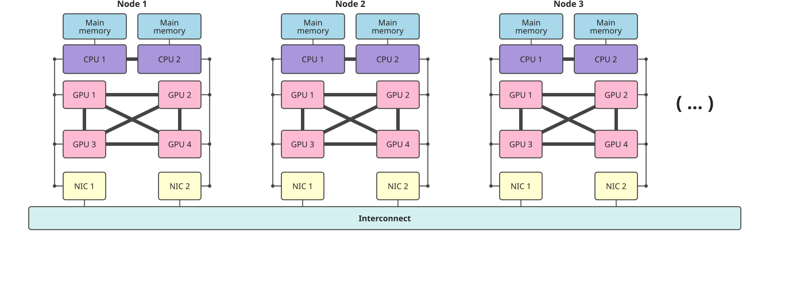

# Introduction

## What we will cover

* [Very brief] recap of the Message Passing Interface (MPI)
* The design of GPU supercomputers and how to distribute work across multiple
  GPUs
* GPU-aware MPI
* Optimization techniques to improve performance of multi-GPU applications

# MPI Recap

## What is MPI? {.smaller}

* The Message Passing Interface (MPI) is a *standard* for distributed memory
  parallel programming.
* It defines an application programming interface (API) to exchange messages
  between processes that don't [necessarily] share memory for C and Fortran:
  * Point to point communication e.g. `MPI_Send`, `MPI_Recv`
  * Collective communication e.g. `MPI_Bcast`, `MPI_Reduce`, `MPI_Alltoall`
* Third-party support for other languages e.g. Python (mpi4py) and Julia
  (MPI.jl)
* Version 5.0 of the standard was released on 5 June 2025 and defined ABI
  compatibility between MPI implementations allowing users to switch between
  implementations without recompiling their code[^1].
* Various different implementations e.g.:
  * Open MPI based: Open MPI, Nvidia HPC-X
  * MPICH based: MPICH, Intel MPI, Cray MPI, MVAPICH

[^1]: Currently only MPICH v5.0+ has support for this but older MPICH-based
implementations have had ABI compatibility between each other for a while.


## Example MPI program (C++)

```cpp
#include <mpi.h>
#include <iostream>

int main(int argc, char* argv[])
{
    MPI_Init(&argc, &argv);

    int world_size;
    MPI_Comm_size(MPI_COMM_WORLD, &world_size);

    int world_rank;
    MPI_Comm_rank(MPI_COMM_WORLD, &world_rank);

    std::cout << "Hello from rank " << world_rank << " of "
              << world_size << std::endl;

    MPI_Finalize();
}
```

## Example MPI program (Fortran)

```fortran
program hello_mpi
  use mpi_f08
  implicit none

  integer :: world_size, world_rank

  call MPI_Init()
  call MPI_Comm_size(MPI_COMM_WORLD, world_size)
  call MPI_Comm_rank(MPI_COMM_WORLD, world_rank)

  print *, "Hello from rank ", world_rank, " of ", world_size

  call MPI_Finalize()
end program hello_mpi
```

## MPI references

* [MPI Forum Documentation](https://www.mpi-forum.org/docs/)
* [Open MPI Documentation](https://docs.open-mpi.org)
* [MPICH Man Pages](https://www.mpich.org/static/docs/latest/)
* [Rookie HPC MPI Docs](https://rookiehpc.org/mpi/index.html)[^1]

[^1]: Some newer/more advanced MPI routines are missing here.

# System design and work distribution

## GPU supercomputer topology diagram

{width=100% fig-alt="Topology of a multi-node GPU supercomputer"}

## Distributing GPUs to local MPI ranks (CUDA/HIP)

For now assume one MPI process per GPU and assign in a round robin fashion:

```cpp
int world_rank;
MPI_Comm_rank(MPI_COMM_WORLD, &world_rank);
MPI_Comm local_comm;
MPI_Comm_split_type(MPI_COMM_WORLD, MPI_COMM_TYPE_SHARED, world_rank,
                    MPI_INFO_NULL, &local_comm);

int local_rank = -1;
MPI_Comm_rank(local_comm, &local_rank);
MPI_Comm_free(&local_comm);

int num_devs = 0;
cudaGetDeviceCount(&num_devs);
cudaSetDevice(local_rank % num_devs);
```

## Distributing GPUs to local MPI ranks (OpenMP)

## Process mapping diagram

## Other ways of distributing

<!-- Multiple MPI ranks per GPU -->
<!-- OpenMP threading + GPU offloading -->

# GPU-aware MPI

## What is GPU-aware MPI?

<!-- Also mention GPU support required in MPI implementation -->

## Passing GPU pointers to MPI (CUDA/HIP)

## Passing GPU pointers to MPI (OpenMP)

## How to build GPU-aware MPI programs

<!-- Mention both CUDA/HIP and OpenMP  -->

## What's happening under the hood?

## No GPU-aware MPI

## GPU-aware MPI without P2P/RDMA

## GPU-aware MPI with P2P/RDMA

## Example: Jacobi solver

## Example: Domain decomposition

## Exercise: Jacobi solver

## Exercise: Solution

# Optimization techniques

## Why optimization is *more* important on GPUs

## Recap: Node architecture and system topology

## NUMA, affinity and GPU distribution

## Example GPU binding script

## Exercise: Binding scripts

## Packing kernels

<!-- Remove MPI derived datatypes -->
<!-- Mention asynchronous kernels -->

## Non-blocking MPI communication

## Collective operations

## Exercise: Packing kernels and non-blocking communication

## Exercise Solution

## Overlapping communication and computation

## Exercise: Overlapping communication and computation

## Exercise: Solution

# Conclusion

## Summary

## Additional resources and references
